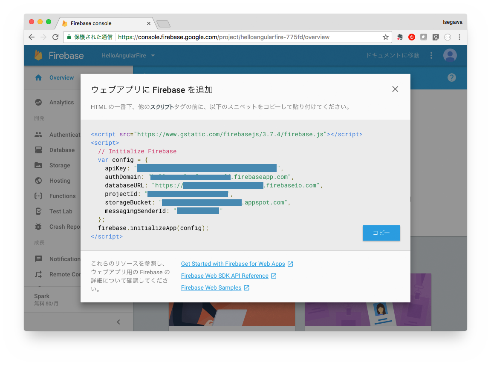

# 勉強会について
## 概要
サーバーレスの時代ついに到来!

Webデザインとコーディングのスキルさえあれば、インフラ構築やサーバーサイドのプログラミングなしに、本格的なWebアプリが実現できる時代になってきました。

世界的にmBaaSのデファクトスタンダードになりつつある「Google Firebase」と、日本でも人気急上昇中の「Angular2」を用いたハンズオンセミナーを開催します。

作りたいものがあるが、サーバーサイドの設計・構築・実装に困っていたWebデザイナーやフロントエンジニアの方、個人でサービスを立ち上げたいが、インフラ構築・運用・コストがネックになって、なかなか踏み出せない方などなど、ご興味のある方は奮ってご参加ください。

- 2017/4/8@東京
    - https://dreamarts.connpass.com/event/50292/
- 2017/4/9@東京
    - https://dreamarts.connpass.com/event/50494/
- 2017/4/22@広島
    - https://da-oriduru.connpass.com/event/50333/

## 事前条件
- javascript等のオブジェクト指向言語を一つでも使ったことがあり、クラス・メソッド・フィールドなどの用語を一応理解している方を対象としています。プログラミングの初歩的な説明は割愛しますので、もし不慣れな場合は、プログラミングの入門書等で事前に予習をお願いします。

## 目次
1. 事前課題・・・環境設定とHello World!
    1. 環境のセットアップ（事前課題1）
    1. Hello Angular（事前課題2）
    1. Hello Firebase（事前課題3）
1. 導入編・・・Firebase, Angularの概要
    1. サーバーレスアーキテクチャの紹介
    1. Firebaseの紹介
    1. Angularの紹介
    1. 技術動向とエンジニアの需要の変化
1. 基礎編・・・Chatツールを作りながらAngularとFirebaseの基礎を理解する
    1. Angularの4要素を理解する・・・アプリの骨組みを作成
    1. Firebaseに接続する・・・ログイン処理の実装
    1. Firebaseのデータの読み書きを理解する・・・タイムラインの実装
    1. スタイルのつけ方を理解する・・・scssの使い方
1. 応用編・・・Chatツールを改善しながら、より実用的なトピックを理解する
    1. Firebaseにデプロイする
    1. Firebase Storageを使う・・・ファイルのアップロード・ダウンロード
    1. ログインユーザ情報を持ち回る・・・ユーザ情報の取得・localStorageの利用
    1. UIライブラリの利用・・・UIを改善する
    - 付録：デバッグツールの利用
    - 付録：単体テストツールの利用
1. 実践編・・・グループワーク
    1. 4人1チームで復習と応用編の課題を進める。チームで独自のテーマを決めて進めてもよい。
    1. 成果発表

## 勉強会の参加前に
- 勉強会参加前に、事前課題1~3（環境のセットアップとHello Worldによる動作確認）を実施しておいてください。
- 事前課題がうまくできない場合は、早めに受付にお越しください。

# 事前課題
## 1. 環境のセットアップ（事前課題1）
### Mac用
1. Googleアカウントを作成
    - https://www.google.co.jp
    - Firebaseを用いるためにはGoogleアカウントが必要です。もしGoogleアカウントをお持ちでない場合は、事前にGoogleアカウントを作成してください。
1. gitのインストール
    - http://qiita.com/furusin_oriver/items/974a7b7fb8c56ad88d6e
1. Chrome（Webブラウザのインストール）
    - https://www.google.co.jp/chrome/browser/desktop/
1. node v6.10.1のインストール
    - https://nodejs.org/ja/
    - nodebrew等によるインストールも可
1. angular-cli 1.0.0-beta.28.3をインストール
    - npm install -g @angular/cli
1. firebase-cliをインストール
    - npm install -g firebase-tools
1. Visual Studio Codeをインストール
    - https://code.visualstudio.com/download
    - エディタは何でもよいですが、当勉強会ではVisual Studio Codeを用います。

### Windows用
※コマンド操作はWindows PowerShell推奨です!

1. Googleアカウントを作成
    - https://www.google.co.jp
    - Firebaseを用いるためにはGoogleアカウントが必要です。もしGoogleアカウントをお持ちでない場合は、事前にGoogleアカウントを作成してください。
1. gitのインストール
    - https://git-scm.com/downloads
1. Chrome（Webブラウザのインストール）
    - https://www.google.co.jp/chrome/browser/desktop/
1. node v6.10.1のインストール
    - https://nodejs.org/ja/download/
    - nodist等によるインストールも可
1. angular-cli 1.0.0-beta.28.3をインストール
    - npm install -g @angular/cli
1. firebase-cliをインストール
    - npm install -g firebase-tools
1. Visual Studio Codeをインストール
    - https://code.visualstudio.com/download
    - エディタは何でもよいですが、当勉強会ではVisual Studio Codeを用います。

#### Windowsで npm installが上手くいかない場合
- Case1: @angular/cliをインストールしてもngコマンドが使えない
  - 別のバージョンやディレクトリのnpmにインストールされている可能性があります。
  - `$ npm config edit` から `prefix` の行をコメントアウトして再度試してください。

- Case2: インストール時に@angular/cliやfirebase-toolsが見つからない場合
  - npmが利用するレジストリの設定が変わっている可能性があります。
  - `$ npm config edit` から `registry` の行をコメントアウトして再度試してください。

## 2. Hello Angular（事前課題2）
1. 勉強会用のフォルダを作成（ターミナルにて）
    - mkdir HelloAngularFire
    - cd HelloAngularFire
1. HelloAngularFire直下にAngular用のプロジェクトを作成
    - ng new AngularChat --style=scss
    - cd AngularChat
    - ng serve
1. ブラウザで動作確認
    - http://localhost:4200
1. ビルド
    - ng build
    - dist以下にindex.htmlなどビルドされたアプリが生成されることを確認する。
    - 次のHello Firebaseにて、dist以下をFirebaseにデプロイする。
    - 次の画像はターミナルでの操作例
    

## 3. Hello Firebase（事前課題3）
### ブラウザにて
1. Googleアカウントでログイン
1. Firebaseを利用開始
    - https://firebase.google.com/?hl=ja
    - 無料で開始を押す。（勉強会の内容は無料枠しか使わない予定。）
    
1. プロジェクトを作成
    - プロジェクト名：HelloAngularFire、国：日本
    
    
    - https://console.firebase.google.com/

### ターミナルにてプロジェクトを作成
1. HelloAngularFireの直下にFirebaseディレクトリを作成する（ターミナルにて）
    - cd ..
    - mkdir Firebase
    - cd Firebase
1. Firebaseにログイン
    - firebase login
1. FirebaseのHosting用の設定をする
    - firebase init
        - ? What Firebase CLI features do you want to setup for this folder? : 上下キーでカーソルを動かしHostingを選択
        - ? What Firebase project do you want to associate as default? : 上下キーでカーソルを動かしHelloAngularFireを選択
        - ? What file should be used for Database Rules? (database.rules.json): そのままEnter
        - ? Do you want to install dependencies with npm now? : Yes
        - ? What do you want to use as your public directory? (public) : そのままEnter
        - ? Configure as a single-page app (rewrite all urls to /index.html)? : Yes
        
    - 以上が成功すると、public, database.rules.json, firebase.jsonなどが生成される。
1. Hello Angularでビルドしたアプリ（AngularChat/dist以下）をFirebaseデプロイ用のプロジェクト内にコピー
    - cp -r ../AngularChat/dist/ public/
1. Firebaseにデプロイ
    - firebase deploy
    - deployコマンドのログの最後の方に、「Hosting URL: https://<Project ID>.firebaseapp.com」が出てきて、そのURLにアクセスして、Angularの「App Works!」の画面が出てくれば成功。

<br><br>
# 導入編
Firebase, Angularの概要。資料は後日公開する予定。

<br><br>
# 基礎編
Chatツールを作りながらAngularとFirebaseの基礎を理解する。

## 完成イメージ


- 画面構成は下記の通り
    - ヘッダー（header）
    - ログイン（login）
    - タイムラインの入力（timeline-input）
    - タイムライン（timeline）
    - タイムラインの各メッセージ（timeline-cell）

## 1. Angularの4要素を理解する
アプリの骨組みを作成する。

```
git checkout angular_structures
```

### Angularの4要素


### component・serviceの作成とTypeScript入門
1. componentとserviceとは
    - componentとは、画面の構成要素を保守や再利用がしやすいように分割したもの。画面を描画するHTMLとスタイルを指定するCSSと処理を記述するTypeScriptからなる。
    - serviceとは、データアクセスや計算ロジックなどの画面横断的な処理を担うもの。
    - componentの処理とserviceはtypescriptで記述する。
1. TypeScriptとは
    - Microsoftが開発したオープンソースの言語。
    - JavaScriptにクラスベースのオブジェクト指向と静的型付けの機能を追加した言語で、JavaScriptの柔軟さゆえのハマりどころを最小化し、大規模開発にも対応できる。
    - JavaScriptと親和性が高く、Javaを簡略化したような文法のため、学習コストも低い。
    - TypeScriptはコンパイルするとJavaScriptに変換されて、実行される。
1. TypeScriptの制御構造
    - 順次
    ```.ts
    var a = 1;
    var b = 2;
    var c = a + b;
    ```
    - 分岐
    ```.ts
    if (0 < c) {
      console.log("plus");
    } else {
      console.log("zero or minus");
    }
    ```
    - 繰り返し
    ```.ts
    // C言語っぽいfor文
    for (var i = 0; i < 10; i++) {
      console.log(i);
    }
    // C言語っぽいwhile文も使える
    var i = 0
    while(i < 10) {
      console.log(i);
      i++;
    }
    // 列挙
    var array = ["a", "b", "c"];
    for (var element of array) {
      console.log(element);
    }
    // forEach関数による列挙も可
    array.forEach((element) => {
      console.log(element);
    });
    ```
1. クラス・プロパティ・メソッドの定義と呼び出し
    - クラス・プロパティ・メソッドの定義
    ```.ts
    // 下記のMessageDataクラスは、CommonDataを継承し、OnInitインターフェースを実装している
    class MessageData extends CommonData implements OnInit {
      // プロパティ（メンバ変数）の定義
      private messageId: string;
      text: string;
      createdBy: string;
      // インスタンス生成時に呼ばれるコンストラクタ
      constructor() {
      }
      // メソッドの定義
      getMessageId(): string {
        return this.messageId;
      }
    }
    ```
    - インスタンスの生成とプロパティの参照
    ```.ts
    var message = new MessageData();
    message.text = "メッセージ本文";
    ```
    - メソッドの呼び出し
    ```.ts
    var message = new MessageData();
    var messageId = message.getMessageId();
    ```

1. 変数・定数
    ```.ts
    let a = 1;    // 変数（ブロックスコープ）
    var b = 2;    // 変数（関数スコープ）
    const c = 3;  // 定数
    ```
    ```.ts
    // varは関数スコープなので、下記でも動く
    function f() {
      {
        var x = 2;
      }
      console.log(x);
    }
    f();
    // letはブロックスコープなので、下記だとエラー
    function f() {
      {
        let x = 2;
      }
      console.log(x);
    }
    f();
    ```
1. TypeScriptの基本型

    | 型名 | 内容 |
    |---|---|
    | boolean | 真偽値 |
    | number | 数値 |
    | string | 文字列 |
    | array | 配列 |
    | any | 任意の型 |
    
1. ログイン処理のためのcomponentとserviceを作成（ターミナルにて）
    - ng generate component header
    - ng generate component login
    - ng generate service login
    - ng serve
    - src/app/servicesのディレクトリを作成
    - login.service.ts, spec.tsをsrc/app/servicesの下に移動
1. headerをapp.component.htmlに追加（Visual Studio Codeにて）
    - app.component.html
    ```.html
    <app-header></app-header>
    ```
    - ブラウザで「http://localhost:4200」を確認
1. loginをheader.component.htmlに追加
    - header.component.html
    ```.html
    <header class="Header">
      <app-login></app-login>
    </header>
    ```
    - ブラウザで「http://localhost:4200」を確認
1. LoginComponent, LoginServiceの呼び出し
    - login.service.tsにダミーのログイン処理を記述
    ```.ts
    login(success: () => void, failure: (error) => void) {
      // 一旦無条件で成功を返す
      success();
    }
    - 「success: () => void」のようにコールバック関数の型を指定することができる。
    ```
    - LoginServiceをlogin.component.tsから呼びだす
        1. LoginServiceをインポートする
        1. @Componentの中のprovidersにLoginServiceを追加する
        1. constructorにLoginService型の変数を記載すると、DI（Dependency Injection）される
    ```.ts
    import { LoginService } from '../services/login.service';

    @Component({
        :
      providers: [LoginService]
    })
    export class LoginComponent implements OnInit {
      constructor(private loginService: LoginService) { }
        :
      login() {
        this.loginService.login(() => {
          // 成功
          console.log("login succeed.");
        }, (error) => {
          // 失敗
        });
      }
    }
    ```
    - login.component.htmlからログイン処理
    ```.html
    <button (click)="login()">Login</button>
    ```
    - ブラウザで動作確認

### templateの記法とデータバインド
1. templateとは
    - HTMLを動的に生成する際の元となるもの。
    - HTMLで記述する。
    - CSSのクラスやスタイルの指定の仕方もHTMLそのまま。
1. データバインド（TypeScript → HTML）
    - header.component.ts（Visual Studio Codeで編集）
    ```.ts
    export class HeaderComponent implements OnInit {
      // プロパティは同一コンポーネントのtemplate(html)から参照可
      headerTitle = "Angular, Firebase勉強会";
    }
    ```
    - header.component.html
    ```.html
    <header class="Header">
      <!-- {{プロパティ名}}で、HTMLにプロパティの値が埋め込まれる -->
      <span class="Header_title">{{headerTitle}}</span>
      <app-login></app-login>
    </header>
    ```
1. データバインド（HTML → TypeScript）とイベント処理
    - timelineとtimeline-inputのコンポーネントを追加（ターミナルにて）
        - ng generate component timeline
        - ng generate component timeline-input
        - ng serve
    - timeline-input.component.htmlをVisual Studio Codeで編集
    ```.html
    <textarea #inputText></textarea>
    <button (click)="sendMessage(inputText)">送信</button>
    ```
    - timeline-input.component.tsを編集
    ```.ts
    sendMessage(inputText: HTMLTextAreaElement) {
      console.log(inputText.value);
    }
    ```
    - timeline-inputをtimeline.component.htmlに追加
    ```.html
    <app-timeline-input></app-timeline-input>
    ```
    - timelineをapp.component.htmlに追加
    ```.html
    <app-timeline></app-timeline>
    ```
    - 引数で受け渡しをしなくても、JavaScriptと同じようにdocument.getElementById()やJQueryでHTMLのエレメントを取得することができる。
1. 双方向データバインド（HTML ↔ TypeScript） <- 実装不要
    - timeline-input.component.html
    ```.html
    <textarea [(ngModel)]="text"></textarea>
    ```
    - timeline-input.component.ts
    ```.ts
    text: string;
    sendMessage(inputText: HTMLTextAreaElement) {
      console.log(this.text);
      this.text = "";
    }
    ```
1. HTMLタグの繰り返し表示（*ngFor）
    - timeline.component.html
    ```.html
    <div *ngFor="let message of messagesArray">{{message}}</div>
    ```
    - timelie.component.ts
    ```.ts
    messagesArray = ["aaa", "bbb", "ccc"];
    ```
1. HTMLタグの条件付き表示（*ngIf） <- 実装不要
    - login.component.html
    ```.html
    <div *ngIf="errorMessage">{{errorMessage}}</div>
    ```
    - login.component.ts
    ```.ts
    errorMessage: string = null
    login() {
      this.loginService.login(() => {
        // 成功
      }, (error) => {
        // 失敗
        this.errorMessage = "ログインできませんでした。(" + error.message + ")";
      });
    }
    ```
1. HTMLタグの条件付き表示（*ngSwitch）
    - login.component.html
    ```.html
    <div [ngSwitch]="isLoggedIn">
      <button *ngSwitchCase="false" class="Login_button" (click)="login()">Login</button>
      <button *ngSwitchCase="true" class="Login_button" (click)="logout()">Logout</button>
    </div>
    ```
    - login.component.ts
    ```.ts
    isLoggedIn = false;
    login() {
      this.loginService.login(() => {
        // 成功
        this.isLoggedIn = true;
      }, (error) => {
        // 失敗
        this.isLoggedIn = false;
      });
    }
    ```
1. HTMLタグのattributeを動的に変更（[attribute名]） <- 実装不要
    - timeline-input.component.html
    ```.html
    <textarea [class]="textareaClass"></textarea>
    <!-- 下記のような特殊記法もあるがあまり使わない -->
    <textarea [ngClass]="textareaClass"></textarea>
    ```
    - timeline-input.component.ts
    ```.ts
    textareaClass = "TimelineInput_textarea";
    sendMessage(inputText: HTMLTextAreaElement) {
      if (check(inputText)) {
        // チェックOK
        this.textareaClass = "TimelineInput_textarea";
      } else {
        // チェックNG
        this.textareaClass = "TimelineInput_textarea TimelineInput_textareaError";
      }
    }
    ```
1. HTMLタグのclassの一部を動的に追加・削除したい場合 <- 実装不要
    - timeline-input.component.html
    ```.html
    <textarea [class.TimelineInput_textarea]="true" [class.TimelineInput_textareaError]="hasError"></textarea>
    ```
    - timeline-input.component.ts
    ```.ts
    hasError = false;
    sendMessage(inputText: HTMLTextAreaElement) {
      if (check(inputText)) {
        // チェックOK
        this.hasError = false;
      } else {
        // チェックNG
        this.hasError = true;
      }
    }
    ```

### routerの設定
1. routerとは
    - URLによってコンポーネントを切り替える機能。
1. routerの設定
    - app.modules.tsにrouter設定を追加
    ```.ts
    import { RouterModule, Routes } from '@angular/router';
      :
    const routeSettings: Routes = [
      { path: 'timeline', component: TimelineComponent }
    ];

    @NgModule({
        :
      import: [
        :
        RouterModule.forRoot(routeSettings),
        :
      ],
    });
    ```
    - テンプレートHTMLに「<router-outlet>」をセットすると、URLに応じて「<router-outlet>」の部分が切り替わるようになる
    - app.component.html
    ```.html
    <app-timeline></app-timeline>
    ```
      ↓　無条件に表示していたapp-timelineをrouter-outletに置き換え
    ```.html
    <router-outlet></router-outlet>
    ```
1. routerによる画面切り替え
    - ログインに成功したらtimelineコンポーネントを表示するように修正する
    - login.component.ts
    ```.ts
    import { Router } from '@angular/router';
      :
    constructor(private loginService: LoginService, private router: Router) { }
    login() {
      this.loginService.login(() => {
        // 成功
        this.router.navigate(["timeline"]);
      }, (error) => {
        // 失敗
          :
      });
    }
    ```

## 2. Firebaseに接続する
ログイン処理を実装する。

```
git checkout login_firebase
```

### Firebase consoleからGoogle認証を有効にする（ブラウザにて）
1. ブラウザでFirebase consoleを開く
1. 左メニューのAuthenticationを選択
1. ログイン方法のタブを選択
1. Googleをクリックして有効にする
    

### angularfire2の導入（ターミナルにて）
1. ターミナルにてHelloAngularFire/AngularChatのディレクトリに移動し、下記のインストールコマンドを実行
    - npm install firebase angularfire2 --save
    - angularfire2のソースとドキュメントは下記にある
        - https://github.com/angular/angularfire2

### FirebaseのAPIキーをセット
1. FirebaseのAPIキーを取得
    - ブラウザでFirebase consoleを開き、左メニューのOverviewを選択
    
    - ウェブアプリにFirebaseを追加をクリック
    
    - var config = {...}　の部分だけをコピー
1. Visual Studio Codeにて、AngularChat/src/app/firebaseConfig.jsを作成し、APIキーをコピー
    - firebaseConfig.js
    ```.js
    export const firebaseConfig = {  
      apiKey: "*********************************",
      authDomain: "****************.firebaseapp.com",
      databaseURL: "https://*****************.firebaseio.com",
      projectId: "******************",
      storageBucket: "******************.appspot.com",
      messagingSenderId: "***************"
    }
    ```
1. アプリ起動時にfirebaseのAPIキーを読み込むようにする
    - app.module.ts
    ```.ts
    // 1. angularfire2とfirebaseConfigをインポート
    import { AngularFireModule, AuthProviders, AuthMethods } from 'angularfire2';
    import { firebaseConfig } from './firebaseConfig';

    // 2. firebaseAuthConfigに認証方法を定義
    const firebaseAuthConfig = {
      provider: AuthProviders.Google,
      method: AuthMethods.Popup
    };

    // 3. AngularFireModleにAPIキーと認証方法の設定を読み込ませる
    @NgModule({
        :
      imports: [
          :
        AngularFireModule.initializeApp(firebaseConfig, firebaseAuthConfig)
      ],
        :
    })
    ```
1. AngularChat/src/tsconfig.app.jsonのcompilerOptionsに「"allowJs": true」を追加
    ```.js
    {
      "extends": "../tsconfig.json",
      "compilerOptions": {
          ：
        "allowJs": true
      },
        ：
    }
    ```

### ログイン処理の実装
1. LoginServiceにログイン処理を追加
    - login.service.ts
    ```.ts
    // 1. angularfire2をインポート
    import { AngularFire } from 'angularfire2';
    @Injectable()
    export class LoginService {
      // 2. constructorでDIにより生成されたAngularFireのインスタンスを受け取る変数を定義
      constructor(private af: AngularFire) { }

      // 3. ログイン処理を実装
      login(success: () => void, failure: (error) => void) {
        this.af.auth.login().then((authState) => {
          // 成功
          success();
        }, (error) => {
          // 失敗
          failure(error);
        });
      }
    }
    ```
    - 動作確認
1. ログアウト処理を追加
    - login.service.ts
    ```.ts
    logout() {
      this.af.auth.logout();
    }
    ```
    - login.component.ts
    ```.ts
    logout() {
      this.loginService.logout();
      this.router.navigate([""]);
    }
    ```
1. アプリ起動時のログイン判定処理を追加
    - login.service.ts
    ```.ts
    isLoggedIn(result: (isLoggedIn: boolean) => void) {
      this.af.auth.subscribe((auth) => {
        result(auth ? true : false);
      }, (error) => {
        result(false);
      });
    }    
    ```
    - login.component.ts
    ```.ts
    ngOnInit() {
      this.loginService.isLoggedIn((isLoggedIn) => {
        this.isLoggedIn = isLoggedIn;
        if (isLoggedIn) {
          this.router.navigate(["timeline"]);
        }
      });
    }    
    ```

## 3. Firebaseのデータの読み書きを理解する
タイムラインを実装する

```
git checkout read_write_realtimedatabase
```

### 入力画面の作成
メッセージ入力画面を作成することで、Firebaseへのデータの書き込み方法を理解する。
1. timeline-input.component.htmlにテキストエリアと送信ボタンを追加
    ```.html
    <textarea [class.TimelineInput_textarea]="true" [class.TimelineInput_textareaError]="hasError" placeholder="メッセージを入力" #inputText></textarea>
    <button class="TimelineInput_button" (click)="sendMessage(inputText)">送信</button>
    ```
1. メッセージデータをFirebaseに登録するためのサービスを作る（ターミナルにて）
    - ng generate service messages
    - 作成されたmessages.service.ts, spec.tsをsrc/app/servicesの下に移動
1. messages.service.tsにデータの登録処理を記載する
    ```.ts
    // 1. Firebase関連ライブラリをインポート
    import { AngularFire, FirebaseListObservable } from 'angularfire2';
    import * as firebase from 'firebase';

    @Injectable()
    export class MessagesService {
      // 2. AngularFireのインスタンスを受け取る
      constructor(private af: AngularFire) { }

      // 3. データの登録処理を記載する
      sendMessage(message: MessageData) {
        this.af.database.list("/messages").push(message);
      }
    }

    // 4. MessageDataのクラスを定義する
    export class MessageData {
      messageId: string;
      text: string;
      createdUserName: string;
      createdBy: string;
      createdAt: any;

      constructor(item) {
        if (item) {
          // TODO: 受け取ったオブジェクトをMessageDataのプロパティにマッピングする
        } else {
          this.createdUserName = "伊勢川 暁";
          this.createdAt = firebase.database.ServerValue.TIMESTAMP;
        }
      }
    }
    ```
1. timeline-input.component.tsでMessagesServiceを呼びだす
    ```.ts
    // 1. MessagesServiceをインポート
    import { MessagesService, MessageData } from '../services/messages.service';

    // 2. providersにMessagesServiceを追加
    @Component({
      selector: 'app-timeline-input',
      templateUrl: './timeline-input.component.html',
      styleUrls: ['./timeline-input.component.scss'],
      providers: [MessagesService]
    })

    export class TimelineInputComponent implements OnInit {
        :
      // 3. constructorでDIされたMessagesServiceのインスタンスを受け取る
      constructor(private messagesService: MessagesService) { }
        :
      // 4. 送信ボタンが押された際に、メッセージの投稿処理を呼びだす
      sendMessage(inputText: HTMLTextAreaElement) {
        const message = new MessageData(null);
        message.text = inputText.value;
        this.messagesService.sendMessage(message);
        inputText.value = "";
      }
    }
    ```

### 一覧画面の作成
タイムラインのメッセージ一覧画面を作成することで、Firebaseからのデータ取得と、Angularによるリスト表示の方法を理解する。
1. messages.service.tsにメッセージデータの取得処理を記載する
    ```.ts
    export class MessagesService {
        :
      // 1. メッセージデータの取得処理を実装
      observeMessages(success: (messages: Array<MessageData>) => void) {
        this.af.database.list("/messages").subscribe((items) => {
          const messages = new Array<MessageData>();
          for (const item of items) {
            messages.push(new MessageData(item));
          }
          if (success) {
            success(messages);
          }
        }, (error) => {
          
        });
      }
        :
    }

    export class MessageData {
        :
      constructor(item) {
        if (item) {
          // 2. Firebaseから取得したデータをMessageDataクラスにマッピングする処理を実装
          this.messageId = item.$key;
          for (const key of Object.keys(item)) {
            this[key] = item[key];
          }
        } else {
          :
        }
      }
    }
    ```
1. timeline.component.tsでMessagesServiceのobserveMessagesを呼びだす
    ```.ts
    // 1. MessagesServiceをインポート
    import { MessagesService, MessageData } from '../services/messages.service';

    // 2. providersにMessagesServiceを追加
    @Component({
      selector: 'app-timeline',
      templateUrl: './timeline.component.html',
      styleUrls: ['./timeline.component.scss'],
      providers: [MessagesService]
    })

    export class TimelineComponent implements OnInit {
      // 3. 画面に受け渡すメッセージの配列を定義
      messagesArray: Array<MessageData>;

      // 4. MessagesServiceのインスタンスを受け取る
      constructor(private messages: MessagesService) { }

      ngOnInit() {
        // 5. observeMessagesを呼びだし、受け取ったメッセージを画面に渡す
        this.messages.observeMessages((messages) => {
          this.messagesArray = messages;
        });
      }
    }
    ```
1. timeline.component.htmlでメッセージデータの一覧を表示
    ```.html
    <app-timeline-input></app-timeline-input>
    <div *ngFor="let message of messagesArray">{{message?.text}}</div>
    ```
    - ブラウザで投稿したメッセージが画面上に表示されることを確認する

### タイムラインセルのコンポーネントを分離する
Angularにて親から子のコンポーネントにデータを受け渡す方法を理解する。
1. timeline-cellのコンポーネントを作成（ターミナルにて）
    - ng generate component timeline-cell
1. 親コンポーネントで受け渡すデータをセットする
    - timeline.component.html
    ```.html
    <app-timeline-cell *ngFor="let message of messagesArray" [message]="message"></app-timeline-cell>
    ```
1. 子コンポーネントでデータを受け取る
    - timeline-cell.component.ts
    ```.ts
    // 1. angular/coreからInputをインポート
    import { Component, OnInit, Input } from '@angular/core';
    import { MessageData } from '../services/messages.service';
      :
    export class TimelineCellComponent implements OnInit {
      // 2. @Input()の後に受け取るデータを定義
      @Input() message: MessageData;
        :
    }
    ```
    - timeline-cell.component.html
    ```.html
    <div class="TimelineCell">
      
      <span>{{message.createdUserName}}</span>
      <span>{{message.createdAt | date: 'yyyy/MM/dd hh:mm'}}</span>
      <div>{{message.text}}</div>
    </div>
    ```

## 4. スタイルのつけ方を理解する
スタイルのつけ方、scssの使い方をマスターする。

```
git checkout add_styles
```

### scssについて
1. scssとは
    - CSSで変数、サブルーチン、演算子、if文、for文、importなどを使えるようにした言語
    - 普通のCSSがそのまま使え、変数などの書き方を覚えるだけでよい
    - scssをさらに簡略化したsassという記法もある
    - angularでscssを使いたい場合は、プロジェクト作成の際にstyleオプションをつけるとよい
        - ng new AngularChat --style=scss
1. scssの基本文法
    - 変数は$マークで始まる
    ```.css
    // 変数の定義
    $headerHeight: 44px;
    $baseMargin: 8px;
    // 変数の呼び出し
    height: $headerHeight - $baseMargin * 2;
    ```
    - mixin（サブルーチン的なもの）
    ```.css
    // mixinの定義
    @mixin border-radius($radius) {
      -webkit-border-radius: $radius;
      -moz-border-radius: $radius;
      -ms-border-radius: $radius;
      -o-border-radius: $radius;
      border-radius: $radius;
    }
    // mixinの呼び出し
    .box { @include border-radius(10px); }
    ```
    - 外部のscssを参照する場合は@importを用いる
    ```.css
    @import "../../assets/scss/sizes.scss";
    ```

### ヘッダーにスタイルをつける
1. HTMLにクラス名を指定する
    - header.component.html
    ```.html
    <header class="Header">
      <span class="Header_title">{{headerTitle}}</span>
      <app-login></app-login>
    </header>
    ```
1. ヘッダーに色を付けて横いっぱいに表示する
    - header.component.scss
    ```.css
    $headerHeight: 44px;
    .Header {  
      height: $headerHeight;
      width: 100%;
      background-color: orange;
    }
    ```
1. ヘッダータイトルを白抜き、縦中央寄せにする
    - header.component.scss
    ```.css
    $headerHeight: 44px;
    $baseMargin: 8px;
    .Header {  
      height: $headerHeight;
      width: 100%;
      background-color: orange;

      &_title {
        color: white;
        margin-left: $baseMargin;
        height: $headerHeight;
        line-height: $headerHeight;
        text-align: center;
        float: left;
      }
    }
    ```
1. ログインボタンを右上に配置する
    ```.css
    $headerHeight: 44px;
    $baseMargin: 8px;
    $errorColor: red;
    .Login {
      &_button {
        background-color: rgba(255, 255, 255, 0.2);
        color: white;
        border: 0;
        height: $headerHeight - $baseMargin * 2;
        margin-top: $baseMargin;
        position: relative;
        right: $baseMargin;
        float: right;
      }

      &_errorMessage {
        color: $errorColor;
      }
    }
    ```
1. サイズ指定や色指定を共通のファイルに分離してインポートする
    - src/assets/scss/sizes.scss
    ```.css
    $baseMargin: 8px;
    $headerHeight: 44px;
    ```
    - src/assets/scss/colors.scss
    ```.css
    $headerColor: orange;
    $errorColor: red;
    ```

# 応用編
Chatツールを改善しながら、より実用的なトピックを理解する

## 1. Firebaseにデプロイする
ビルドとデプロイの復習
1. AngularChatをビルド（ターミナルにて）
    - AngularChatのディレクトに移動
    - ng build
1. ビルドしたアプリ（AngularChat/dist以下）をFirebaseデプロイ用のプロジェクト内にコピー
    - cd ../Firebase
    - cp -r ../AngularChat/dist/ public/
1. Firebaseにデプロイ
    - firebase deploy
    - deployコマンドのログの最後の方に、「Hosting URL: https://<Project ID>.firebaseapp.com」が出てきて、そのURLにアクセスして、AngularChatの画面が出てくることを確認する。

## 2. Firebase Storageを使う
ファイルのアップロード・ダウンロード

```
git checkout firebase_storage
```

1. ファイル選択画面を表示する
    - timeline-input.component.html
    ```.html
    <input id="InputFiles" type="file" name="files[]" accept="image/*" multiple />
    ```
1. 選択されたファイルを受け取る
    - timeline-input.component.ts
    ```.ts
    ngOnInit() {
      this.observeFileSelection();
    }
      :
    /** ファイルの選択を監視 */
    private observeFileSelection() {
      const inputTag = document.getElementById("InputFiles");
      if (inputTag) {
        inputTag.addEventListener("change", (event) => {
          const target = <HTMLInputElement>event.target;
          this.uploadFiles(target.files);
        });
      }
    }

    /** ファイルのアップロード */
    private uploadFiles(files: FileList) {
      // TODO: ファイルのアップロード処理
      console.log(files);
    }
    ```
1. ファイルのアップロード処理を実装
    - messages.service.ts
    ```.ts
    // 1. Inject, FirebaseAppをインポート
    import { Injectable, Inject } from '@angular/core';
    import { AngularFire, FirebaseListObservable, FirebaseApp } from 'angularfire2';
      :
      // 2. FirebaseAppへの参照を受け取る
      constructor(private af: AngularFire, @Inject(FirebaseApp) private firApp: firebase.app.App) { }
      // 3. ファイル送信のロジックを実装
      sendMessage(message: MessageData): firebase.database.ThenableReference {
        return this.af.database.list("/messages").push(message);
      }
      sendFiles(files: FileList) {
        for (let i = 0; i < files.length; i++) {
          const file = files.item(i);
          // 3-1. メッセージを投稿してIDを取得
          const msg = new MessageData(null);
          msg.fileType = file.type;
          msg.fileName = file.name;
          const msgRef = this.sendMessage(msg);
          // 3-2. メッセージのIDをストレージのパスにセット
          const storagePath = "/messages/" + msgRef.key + "_" + msg.fileName;
          const storageRef = this.firApp.storage().ref().child(storagePath);
          // 3-3. ファイルをストレージにアップロードし、完了したらメッセージデータを更新
          const task = storageRef.put(file);
          task.then((snapshot) => {
            msg.filePath = snapshot.metadata.fullPath;
            msg.downloadUrl = snapshot.downloadURL;
            msgRef.set(msg);
          });
        }
      }
        ：
    export class MessageData {
      // 4. ファイル用の項目を追加
      fileType: string;
      fileName: string;
      filePath: string;
      downloadUrl: string;
        :
      // 5. ファイルタイプの判定処理を追加（後ほど使う）
      isPhoto(): boolean {
        return (this.fileType && this.fileType.match(/image\/.*/ig)) ? true : false;
      }
    }
    ```
    - timeline-input.component.ts
    ```.ts
    /** ファイルのアップロード */
    private uploadFiles(files: FileList) {
      this.messagesService.sendFiles(files);
    }
    ```
1. 画像の表示処理を追加
    - timeline-cell.component.html
    ```.html
    
    ```
    - timeline-cell.component.ts
    ```.ts
    // 1. URLを画面に受け渡すためのメンバ変数を定義
    imageUrl: string = null;
      :
    // 2. メッセージタイプが写真の場合、画像を表示
    ngOnInit() {
      if (this.message.isPhoto && this.message.downloadUrl) {
        this.imageUrl = this.message.downloadUrl;
      }
    }
    ```

## 3. ログインユーザ情報を持ち回る
Googleからユーザ情報を取得し、ローカルに保存して持ち回る。

```
git checkout save_userinfo
```

1. 現在のユーザ情報を保存して持ち回るクラス（CurrentUser）を作成する
    - login.service.ts
    ```.ts
    namespace CurrentUserKeys {
      export const USER_NAME = "current_user_name";
      export const PHOTO_URL = "current_user_photo_url";
    }

    export class CurrentUser {
      static userName(): string {
        return localStorage.getItem(CurrentUserKeys.USER_NAME);
      }

      static photoUrl(): string {
        return localStorage.getItem(CurrentUserKeys.PHOTO_URL);
      }

      static setUserName(userName: string) {
        localStorage.setItem(CurrentUserKeys.USER_NAME, userName);
      }

      static setPhotoUrl(url: string) {
        localStorage.setItem(CurrentUserKeys.PHOTO_URL, url);
      }

      static removeUserInfo() {
        localStorage.removeItem(CurrentUserKeys.USER_NAME);
        localStorage.removeItem(CurrentUserKeys.PHOTO_URL);
      }
    }
    ```
1. ログイン情報からユーザ情報を取得しCurrentUserに保存する
- login.service.ts
```.ts
export class LoginService {
    :
  login(success: () => void, failure: (error) => void) {
    this.af.auth.login().then((authState) => {
      // ログイン情報からユーザ情報を取得し保存
      CurrentUser.setUserName(authState.auth.displayName);
      CurrentUser.setPhotoUrl(authState.auth.photoURL);
      // 成功
      success();
    }, (error) => {
      // 失敗
      failure(error);
    });
  }
  logout() {
    this.af.auth.logout();
    // 保存した情報を削除
    CurrentUser.removeUserInfo();
  }
    :
}
```
1. メッセージ投稿時にユーザ情報を付加する
- messages.service.ts
```.ts
export class MessageData {
    :
  // 1. ユーザ画像のURLを保存
  userImageUrl: string;
    :
  constructor(item) {
    if (item) {
      :
    } else {
      // 2. 保存されたユーザ名とユーザ画像のURLをセット
      this.createdUserName = CurrentUser.userName();
      this.userImageUrl = CurrentUser.photoUrl();
      this.createdAt = firebase.database.ServerValue.TIMESTAMP;
    }
  }
```
1. ユーザの顔写真をタイムラインに表示する
- timeline-cell.component.ts
```.ts
  ngOnInit() {
    if (this.message && this.message.isPhoto && this.message.downloadUrl) {
      this.imageUrl = this.message.downloadUrl;
    }
    // 顔写真のURLがセットされていれば表示
    if (this.message && this.message.userImageUrl) {
      this.userImageUrl = this.message.userImageUrl;
    }
  }
```

## 4. UIライブラリの利用
UIを改善する

```
git checkout ui_library
```

### UIライブラリの概要
- semantic.uiやbootstrapなどWeb画面を作る際のメジャーなライブラリをAngularでも用いることができる。
- Angular2のTypeScriptで使いやすいようにラップしたライブラリも存在する
    - ngSemantic
        - https://github.com/vladotesanovic/ngSemantic
    - ngBootstrap
        - https://ng-bootstrap.github.io/#/home
    - いずれも非常に有名で機能も豊富なライブラリで、どっちにも似たような機能があるが、全ての機能がAngular用にコンポーネント化されている訳ではない。
    - それぞれの部品の完成度は高いが、そのぶん自由度は少ない。
    - セットアップは少し面倒。
    - .jsファイルを切り出してTypeScriptからインポートすれば、ngSemantic, ngBootstrapを用いなくても利用することができる。
### ngSemanticを使えるようにする
1. ngSemanticをインストール（ターミナルにて）
    - AngularChatのディレクトリに移動
    - npm install ng-semantic --save
    - npm install jquery --save
    - ソースとドキュメントは下記参照
        - https://github.com/vladotesanovic/ngSemantic
1. 下記をダウンロードし解凍した中身をsrc/assets/semanticの下にすべてコピー
    - https://github.com/Semantic-Org/Semantic-UI-CSS/archive/master.zip
1. AngularChat/.angular-cli.jsonを編集
    ```.js
    "apps": [
      {
          :
        "styles": [
          "styles.scss",
          "assets/semantic/semantic.min.css"
        ],
        "scripts": [
          "../node_modules/jquery/dist/jquery.min.js",
          "assets/semantic/semantic.min.js"
        ],
          :
      }
    ],
    ```
1. app.module.tsにてNgSemanticModuleを読み込む
    ```.ts
    import { NgSemanticModule } from 'ng-semantic/ng-semantic';
      :
    @NgModule({
        :
      imports: [
        BrowserModule,
        FormsModule,
        HttpModule,
        NgSemanticModule,
        RouterModule.forRoot(routeSettings),
        AngularFireModule.initializeApp(firebaseConfig, firebaseAuthConfig)
      ],
        :
    })
    ```
### タイムラインの画像がタップされた際にモーダルで拡大表示する
- timeline-cell.component.html
    ```.html
    <div *ngIf="imageUrl">
      <!-- 1. 写真のプレビューがクリックされた際にモーダル画面を呼びだす -->
      
      <!-- 2. 表示されるモーダルのコンポーネント -->
      <sm-modal title="" class="basic" #detailImage>
        <modal-content>
          
        </modal-content>
      </sm-modal>
    </div>
    ```

## 付録：デバッグツールの利用
## 付録：単体テストツールの利用


